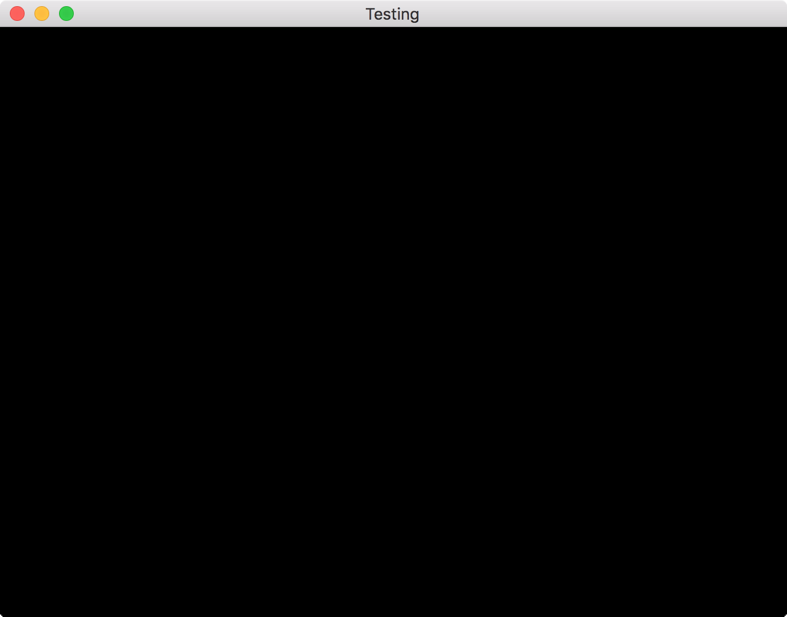

## GLFW 3.2 [](https://godoc.org/github.com/golang-ui/glfw)

Package glfw provides Go bindings for multi-platform library for OpenGL, OpenGL ES and Vulkan development [glfw.org](http://www.glfw.org).<br />
All the binding code has automatically been generated with rules defined in [glfw.yml](/glfw.yml).

### What about go-gl/glfw?

It's cool, use it: [go-gl/glfw](https://github.com/go-gl/glfw). I created this package as a proof of concept that shows how easy it is to create Go bindings for projects like GLFW, also this package avoids any factor of a human error. If some problems with go-gl/glfw arise, I'll have a backup plan! ;)

Also this API allows to pass the `C.GLFWwindow` handle around, for your unsafe-crazy needs.

### Usage

```bash
$ brew install glfw # must be >= 3.2
$ go get github.com/golang-ui/glfw
```

### Demo

There is an example app that shows how to kickstart with GLFW development.

```bash
$ go get github.com/golang-ui/glfw/cmd/glfw-example
```



### Rebuilding the package

You will need to get the [cgogen](https://git.io/cgogen) tool installed first.

```
$ git clone https://github.com/golang-ui/glfw && cd glfw
$ make clean
$ make
```
